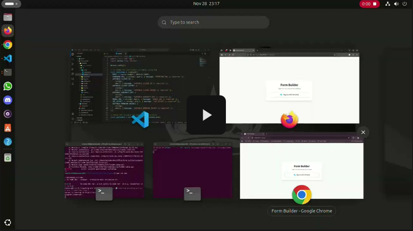

# Form Builder Application

[](https://opensource.org/licenses/MIT)
[](https://react.dev/)
[](https://nodejs.org/)
[](https://www.mongodb.com/)
[](https://www.typescriptlang.org/)
[](https://tailwindcss.com/)

---

## Table of Contents

1.  [Project Overview](#1-project-overview)
2.  [Demo](#2-demo)
3.  [Features](#3-features)
4.  [Tech Stack](#4-tech-stack)
    - [Frontend](#frontend)
    - [Backend](#backend)
5.  [Architecture](#5-architecture)
    - [Frontend Architecture](#frontend-architecture)
    - [Backend Architecture](#backend-architecture)
6.  [Data Models](#6-data-models)
    - [User Model](#user-model)
    - [Form Model](#form-model)
    - [Response Model](#response-model)
7.  [Setup Instructions](#7-setup-instructions)
    - [Prerequisites](#prerequisites)
    - [Airtable OAuth Configuration](#airtable-oauth-configuration)
    - [Airtable Webhook Configuration](#airtable-webhook-configuration)
    - [Backend Setup](#backend-setup)
    - [Frontend Setup](#frontend-setup)
8.  [Conditional Logic Deep Dive](#8-conditional-logic-deep-dive)
9.  [Airtable Webhook Synchronization Deep Dive](#9-airtable-webhook-synchronization-deep-dive)
10. [Author](#10-author)
11. [License](#11-license)

---

## 1. Project Overview

This is a robust full-stack web application meticulously engineered to create dynamic forms that seamlessly integrate with users' Airtable accounts. The core objective is to empower users to effortlessly build custom forms based on their existing Airtable bases and tables, collect data through public form links, and ensure real-time synchronization of submissions and subsequent modifications back to Airtable. Built with a focus on scalability, maintainability, and a delightful user experience, this project showcases a modern development workflow using cutting-edge technologies.

## 2. Demo

Witness the application in action! This video demonstrates the full functionality, from Airtable OAuth login, form creation with conditional logic, form submission, to viewing responses and real-time synchronization via webhooks.

[](https://drive.google.com/file/d/1eWCDvOBr0HR-dLUskRe5jukmZGTClcAu/view)

## 3. Features

- **Airtable OAuth 2.0 Integration:** Secure and streamlined user authentication using Airtable's official OAuth flow, ensuring users grant only necessary permissions.
- **Dynamic Form Builder:**
  - Intuitively select Airtable bases and tables from the connected account.
  - Effortlessly choose fields from the selected Airtable table to form questions.
  - Customize question labels and manage options for select-type fields.
- **Advanced Conditional Logic:**
  - Visually define complex rules to control the visibility and interactivity of form questions.
  - Questions can be configured to dynamically enable/disable based on answers to other questions, supporting `AND`/`OR` logic and various operators (`equals`, `notEquals`, `contains`).
  - Intelligent answer clearing: When a question becomes disabled due to conditional logic changes, its associated answer is automatically cleared to prevent submission of stale data.
- **Public Form Viewer:**
  - Generate unique, publicly accessible URLs for each created form.
  - Users can submit responses directly through this viewer.
- **Comprehensive Response Management:**
  - A dedicated dashboard for form owners to view all submitted responses for their forms.
  - Responses are displayed in a clear, tabular format, mapping submitted data back to original question labels.
- **Real-time Airtable Webhook Synchronization:**
  - Robust backend webhook endpoint to receive and process real-time notifications from Airtable.
  - Automatically updates local MongoDB records when corresponding Airtable records are modified.
  - Gracefully handles Airtable record deletions by marking local responses as `deletedInAirtable`, preserving historical data without hard deletes.

## 4. Tech Stack

### Frontend

- **Framework:** [React](https://react.dev/) (v18+)
- **Build Tool:** [Vite](https://vitejs.dev/)
- **Language:** [TypeScript](https://www.typescriptlang.org/)
- **Styling:** [Tailwind CSS](https://tailwindcss.com/) (for rapid UI development and responsive design)
- **API Communication:** [Axios](https://axios-http.com/)
- **State Management/Data Fetching:** [React Query (TanStack Query)](https://tanstack.com/query/latest) (for efficient server state management)
- **Routing:** [React Router DOM](https://reactrouter.com/en/main)

### Backend

- **Runtime:** [Node.js](https://nodejs.org/) (LTS v18+)
- **Framework:** [Express.js](https://expressjs.com/)
- **Language:** [TypeScript](https://www.typescriptlang.org/)
- **Database:** [MongoDB](https://www.mongodb.com/) (with [Mongoose](https://mongoosejs.com/) ODM for schema validation and interaction)
- **Authentication:** JWT (JSON Web Tokens) for secure session management
- **Environment Variables:** [Zod](https://zod.dev/) & [Dotenv](https://www.npmjs.com/package/dotenv) (for robust environment variable validation)
- **Security:** Node.js `crypto` module (for HMAC SHA256 webhook signature verification)
- **Middleware:** [CORS](https://www.npmjs.com/package/cors), [Body-parser](https://www.npmjs.com/package/body-parser)

## 5. Architecture

The application adheres strictly to a **Feature-Sliced Design (FSD)** pattern, ensuring a highly modular, scalable, and maintainable codebase. This architecture promotes clear separation of concerns, co-locates related code, and facilitates independent development of features.

### Frontend Architecture

The React application's `src` directory is organized into `app`, `features`, and `shared` layers:

```
frontend/
└── src/
    ├── app/             # Application-wide setup: routing, global providers (Auth, React Query), main layout, global styles.
    │
    ├── features/        # Core business features: self-contained modules for Authentication, Forms, Dashboard, Responses.
    │   └── <feature_name>/ # E.g., 'auth', 'forms', 'dashboard', 'responses'
    │       ├── api/         # Feature-specific API interactions
    │       ├── components/  # Reusable UI components specific to this feature
    │       ├── routes/      # Main pages/views for the feature
    │       └── <other_logic>/ # Hooks, utilities, types specific to the feature
    │
    └── shared/          # Reusable, application-agnostic code: configured API client (Axios instance), generic UI components, utility functions.
```

### Backend Architecture

The Node.js/Express.js backend mirrors the FSD pattern, organizing code by feature:

```
backend/
└── src/
    ├── config/          # Global configurations: database connection, environment variable validation.
    ├── middleware/      # Shared Express middleware: authentication, Airtable token checks.
    ├── models/          # Mongoose schemas and models (User, Form, Response).
    │
    ├── features/        # Business features: 'auth', 'airtable', 'forms', 'responses', 'webhooks'.
    │   └── <feature_name>/ # E.g., 'auth', 'forms', 'webhooks'
    │       ├── <feature>.controller.ts # Handles HTTP request/response logic, orchestrates service calls.
    │       ├── <feature>.routes.ts     # Defines API endpoints for the feature.
    │       ├── <feature>.service.ts    # Encapsulates core business logic, interacts with models.
    │       └── <feature>.validation.ts # (Optional) Schema validation for incoming request data.
    │
    └── server.ts        # Main entry point: sets up Express app, middleware, and mounts all feature routers.
```

## 6. Data Models

### User Model (`backend/src/models/User.ts`)

Represents an authenticated user, storing their Airtable credentials and profile information.

- **`airtableUserId`**: Unique identifier from Airtable.
- **`airtableAccessToken`**: Encrypted token for Airtable API access.
- **`airtableRefreshToken`**: Encrypted token for refreshing access.
- **`airtableData`**: User profile data obtained from Airtable.

### Form Model (`backend/src/models/Form.ts`)

Defines the structure of a custom form created by a user, linked to an Airtable table.

- **`name`**: Display name of the form.
- **`owner`**: Reference to the `User` who created the form.
- **`airtableBaseId`**: The Airtable Base ID this form is built upon.
- **`airtableTableId`**: The Airtable Table ID providing the questions.
- **`questions`**: An array of `IFormQuestion` objects, each detailing a form field. This includes its `airtableFieldId`, `label`, `type`, `required` status, `options` (for select fields), and `conditionalRules`.

### Response Model (`backend/src/models/Response.ts`)

Stores each submission received for a form, linking it to its parent form and the corresponding Airtable record.

- **`form`**: Reference to the `Form` this response belongs to.
- **`airtableRecordId`**: The ID of the synchronized record in Airtable.
- **`answers`**: A `Map` storing the submitted data as key-value pairs (AirtableFieldId: AnswerValue).
- **`deletedInAirtable`**: A boolean flag indicating if the corresponding record was deleted in Airtable via webhook.

## 7. Setup Instructions

Follow these steps to get the Form Builder application up and running on your local machine.

### Prerequisites

Ensure you have the following installed:

- **Node.js:** v18 or later ([Download here](https://nodejs.org/))
- **npm:** Comes with Node.js
- **MongoDB:** A running instance (e.g., [MongoDB Community Server](https://www.mongodb.com/try/download/community) or a cloud-hosted solution like [MongoDB Atlas](https://www.mongodb.com/atlas))
- **Git:** For cloning the repository

### Airtable OAuth Configuration

1.  **Access Airtable Developer Hub:** Navigate to the [Airtable Developer Hub](https://airtable.com/developers/developer-hub).
2.  **Create a New App:** Click "Create new app". Provide a name (e.g., "Form Builder App") and a description.
3.  **Configure Redirect URL:** In the "OAuth redirect URLs" section, add:
    - For local development: `http://localhost:5173/auth/callback`
    - For deployed instances: Your frontend's deployed callback URL.
4.  **Define Scopes:** Add the following essential scopes. These are critical for the application's functionality.
    - `schema.bases:read`
    - `schema.bases:write`
    - `data.records:read`
    - `data.records:write`
    - `webhook:create`
    - `webhook:read`
    - `webhook:update`
    - `webhook:delete`
5.  **Obtain Credentials:** Note down the generated **`Client ID`** and **`Client Secret`**. These will be used in your backend's `.env` file.

### Airtable Webhook Configuration

After setting up your Airtable OAuth app (step above), you'll configure a webhook within an Airtable base to enable real-time synchronization.

1.  **Open your Airtable Base:** Go to the specific Airtable Base and Table you intend to use with your forms.
2.  **Navigate to Automations:** In the Airtable interface, click on "Automations".
3.  **Create a New Automation:** Click "Create a custom automation".
4.  **Set Trigger:** Choose a trigger like "When record updated", "When record created", or "When record deleted". For comprehensive synchronization, you might set up multiple automations for different event types.
5.  **Add Action:** For the action, select "Send a webhook".
6.  **Configure Webhook URL:**
    - For local testing, you'll need a tool like [Ngrok](https://ngrok.com/) to expose your local backend to the internet. Your URL would look like `https://YOUR_NGROK_URL/webhooks/airtable`.
    - For a deployed backend, use your live backend's webhook endpoint, e.g., `https://your-deployed-backend.com/webhooks/airtable`.
7.  **Copy Signing Secret:** Airtable will display a "Signing secret" field for this webhook. **Copy this secret key.** This is crucial for verifying the authenticity of incoming webhooks on your backend.
8.  **Update Backend `.env`:** Add this copied secret key to your `form_builder/backend/.env` file as `AIRTABLE_WEBHOOK_SECRET`.

### Backend Setup

1.  **Clone the repository:**
    ```bash
    git clone https://github.com/madsdev404/form_builder
    cd form_builder/backend
    ```
2.  **Install Dependencies:**
    ```bash
    npm install
    ```
3.  **Configure Environment Variables:** Create a `.env` file in the `form_builder/backend` directory and populate it with the variables obtained from Airtable OAuth, MongoDB connection string, and a JWT secret.
    ```dotenv
    PORT=3000
    FRONTEND_URL=http://localhost:5173
    AIRTABLE_CLIENT_ID=YOUR_AIRTABLE_CLIENT_ID
    AIRTABLE_CLIENT_SECRET=YOUR_AIRTABLE_CLIENT_SECRET
    AIRTABLE_REDIRECT_URI=http://localhost:5173/auth/callback
    MONGO_URI=YOUR_MONGODB_CONNECTION_STRING
    JWT_SECRET=A_VERY_STRONG_RANDOM_SECRET
    AIRTABLE_WEBHOOK_SECRET=YOUR_AIRTABLE_WEBHOOK_SIGNING_SECRET
    ```
4.  **Start the Backend Server:**
    ```bash
    npm run dev
    ```
    The backend will start on `http://localhost:3000` (or your specified PORT).

### Frontend Setup

1.  **Navigate to Frontend Directory:**
    ```bash
    cd form_builder/frontend
    ```
2.  **Install Dependencies:**
    ```bash
    npm install
    ```
3.  **Configure Environment Variables:** Create a `.env` file in the `form_builder/frontend` directory and add the backend URL.
    ```dotenv
    VITE_BACKEND_URL=http://localhost:3000
    ```
4.  **Start the Frontend Development Server:**
    ```bash
    npm run dev
    ```
    The frontend will typically run on `http://localhost:5173`.

## 8. Conditional Logic Deep Dive

The conditional logic feature is designed to create highly interactive and responsive forms.

- **Rule Definition (Frontend):** In the form creation wizard, the `ConditionalLogicBuilder` component allows users to define rules for each question. These rules specify:
  - `logic`: `AND` (all conditions must be met) or `OR` (any condition must be met).
  - `conditions`: An array of `ICondition` objects. Each `ICondition` targets an `airtableFieldId` (another question in the form), an `operator` (`equals`, `notEquals`, `contains`), and a `value` for comparison.
- **Rule Storage (Backend):** These `IConditionalRules` are stored directly within the `questions` array of the `Form` model in MongoDB, ensuring that form logic is persisted with the form definition.
- **Dynamic Evaluation (Frontend):** In the `FormViewerPage`, the `shouldShowQuestion` pure function (located in `frontend/src/features/forms/form.service.ts`) evaluates these stored rules in real-time. It takes a `question` and the current `answers` state, returning `true` if the question should be enabled and `false` otherwise.
- **User Experience (Frontend):**
  - Instead of abruptly hiding questions, the application **disables** fields whose conditions are not met. This provides a clearer user experience, preventing unexpected layout shifts and indicating why a field is currently inactive. Disabled fields are visually styled with reduced opacity.
  - A robust `handleInputChange` mechanism automatically clears the values of questions that become disabled due to changes in controlling fields. This prevents stale or invalid data from being submitted and ensures data integrity.

## 9. Airtable Webhook Synchronization Deep Dive

Real-time data synchronization between Airtable and the application's MongoDB is achieved through a secure webhook mechanism.

- **Webhook Endpoint:** The backend exposes a dedicated `POST /webhooks/airtable` endpoint. This endpoint is configured in Airtable Automations to trigger on specified events (e.g., record updates, deletions).
- **Security (Signature Verification):**
  - All incoming webhooks are rigorously verified using an HMAC SHA256 signature check, leveraging the `AIRTABLE_WEBHOOK_SECRET` shared between Airtable and the backend.
  - A `verifyAirtableWebhookSignature` function (in `backend/src/features/webhooks/webhook.service.ts`) ensures the payload's authenticity and integrity.
  - A timestamp tolerance is implemented to protect against replay attacks.
- **Raw Body Handling:** Special `body-parser` middleware is used in `backend/src/server.ts` to ensure the raw request body is available for signature verification before any JSON parsing occurs.
- **Event Processing:**
  - The `processAirtableWebhook` function (in `backend/src/features/webhooks/webhook.service.ts`) parses the incoming payload to identify the webhook type (`table.update` or `table.destroy`).
  - For `table.update` events, the service extracts new field values and updates the corresponding `answers` in the local `Response` document in MongoDB.
  - For `table.destroy` events, instead of permanently deleting the data, the service sets a `deletedInAirtable: true` flag on the relevant `Response` document in MongoDB. This soft-deletion approach preserves historical data and maintains data integrity.

## 10. Author

- **MD. Abduss Sobhan** - [GitHub](https://github.com/madsdev404) | [LinkedIn](https://linkedin.com/in/madsdev4042)

## 11. License

This project is licensed under the MIT License - see the [LICENSE.md](LICENSE.md) file for details.
